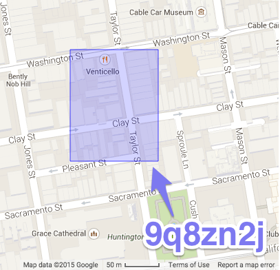

[](https://circleci.com/gh/transitland/onestop-id-registry)
[](https://coveralls.io/r/transitland/onestop-id-registry)

# Onestop ID Registry

This is a machine-readable (and -writable) directory of:

- transit timetable and network feeds available online from authoritative sources
- transit operators/agencies
- transit stops/stations
- transit routes

These [transit data "entities"](#entities) are all labeled with [Onestop IDs](#the-onestop-id-scheme), which are global, immutable, (human) readable, (machine) parsable, and (roughly) geolocated.

Onestop IDs and this registry as a whole can be used as a "crosswalk" to join data from individual [GTFS](https://developers.google.com/transit/gtfs/) feeds, the [U.S. National Transportation Database](http://www.ntdprogram.gov/ntdprogram/), the [Transitland Datastore](https://github.com/transitland/transitland-datastore), [OpenStreetMap](http://openstreetmap.org/), and other public sources of transit, transportation, and geographic information.

Not sure where to start? View [the interactive report](http://onestop-id-registry.transit.land) that's generated each time a Onestop ID is added, edited, or removed. Or, if you prefer technical detail, read on...

## Table of Conents

1. [The Onestop ID Scheme](#the-onestop-id-scheme)
2. Entities
  * [Feeds](#feeds)
  * [Operators](#operators)
  * [Stops](#stops)
3. [Contributing](#contributing)
4. [Test and Validation](#test-and-validation)
5. [Report Generation](#report-generation)
6. [Future Functionality](#future-funciontality)
7. [Contact](#contact)

---

## The Onestop ID Scheme

### Why Onestop IDs?

The Onestop ID is an attempt to link transit data across disparate sources. At present, each transit operator, each government department, and each software developer has their own scheme for identifying and labeling their data. Take, for example, the San Francisco Municipal Transportation Agency:

* It's known colloquially to locals as: `MUNI`.
* It's known in its GTFS feed as `SFMTA`.
* It's known in the US National Transit Database as `#9015`.
* It's known on the GTFS Data Exchange as `san-francisco-municipal-transportation-agency`

When considering just this one operator of transit service, the differences are minor. But the US National Transit Database includes 769 different operators. Building software to handle data from that many different operators, each with a few different IDs, is more of a challenge. And we're still only talking about the U.S.

Just as each transit operator has multiple IDs, each bus stop and train station has at least one ID for each of the operators that serves it. Take, for example, New York's Penn Station:

* It's known to the International Air Transport Association as `ZYP`.
* It's known in Amtrak's GTFS feed as `NYP`.
* It's known in the Long Island Railroad's GTFS feed as `Stop #8`.
* It's known in New Jersey Transit's GTFS feed as `Stop #105`.

In this registry, we've created listings for the San Francisco Municipal Transportation Agency (and we're working on a listing for New York's Penn Station). For the SFMTA, we've assigned the transit agency a Onestop ID of `o-9q8y-sanfranciscomunicipaltransportationagency` and its feed a Onestop ID of `f-9q8y-sanfranciscomunicipaltransportationagency`. You'll find more information attached to these Onestop IDs in this registry under [`/feeds/f-9q8y-SFMTA.json`](https://github.com/transitland/onestop-id-registry/blob/master/feeds/f-9q8y-sanfranciscomunicipaltransportationagency.json) and [`/operators/o-9q8y-sanfranciscomunicipaltransportationagency.geojson`](https://github.com/transitland/onestop-id-registry/blob/master/operators/o-9q8y-sanfranciscomunicipaltransportationagency.geojson). We also use these Onestop IDs in our [Transitland Datastore](https://github.com/transitland/transitland-datastore) service.

### What is in a Onestop ID?

A Onestop ID is an alphanumeric, global, immutable identifer for transit feeds, operators/agencies, stops/stations, and routes provided by authoritative sources that contain timetable and geographic information for transit networks.

Every Onestop ID includes three components, separated by hyphens:

1. the entity type:

    - `f` for feeds
    - `o` for operators/agencies
    - `s` for stops/stations
    - `r` for routes

2. a [geohash](http://en.wikipedia.org/wiki/Geohash), a set of characters that can be translated into a geographic bounding box around the service area of the operator/agency or the location of the stop/station. The more characters, the more precise and smaller the bounding box.

  For example, the geohash `9q8zn2j` refers this purple rectangle in San Francisco:

  

3. an abbreviated name that's short but understandable. No punctuation or special characters. The name doesn't have to be unique across the whole world, but it must be unique within the bounding box of the particular geohash.

### How can I propose changes?

If you have thoughts on how the Onestop ID scheme can be improved, please [contact us](#contact) or [open an issue on this repository](https://github.com/transitland/onestop-id-registry/issues/new).

To add, modify, or delete Onestop IDs, read the section below about [contributing](#contributing).

---

## Entities

This registry contains:

* [Feeds](#feed)
* [Operators, Routes, Stops](#operators-routes-stops)
* [Stop Tiles](#stop-tiles)

### Feeds

In the `/feeds` directory, you'll find one JSON file per feed. Each JSON file provides enough information for the [Transitland Feed Aggregator](#TODO) -- or for your own scripts/services/applications -- to federate authoritative feeds by:

1. fetching the feed file (at present, only a GTFS zip archive)
2. mapping transit operators/agencies in the feed files against records from other sources (using Onestop IDs for operators)
3. linking to terms of use, license, and other information about the feed (included as a tag hash)

### Operators, Routes, Stops

In the `/operators` directory, you'll find one GeoJSON file per operator. Each GeoJSON file provides the following key details to [Transitland Datastore](https://github.com/transitland/transitland-datastore) -- or for your own scripts/services/applications:

* the US National Transit Database ID (in the case of American transit operators)
* the operator's timezone and website (included as a tag hash)
* other common identifiers for the operator
* the geographic bounds of each operator
* all of that operator's routes
* stops served by that operator

### Stop Tiles

In the `/stops` directory, you'll find a series of GeoJSON files named with geohashes. Each is a tile, including all the stops in that geohash's bounding box. Stops are aggregated and joined across all operators, so one stop can potentially be served by multiple operators.

---

## Contributing

**If you're unfamiliar with Github**: Please [open a Github issue](https://github.com/transitland/onestop-id-registry/issues/new) with as much of the following information as you're able to specify, or [contact us](#contact) for assistance.

### Contributing a Feed

1. Fork this repository and create a new branch for your contribution.
2. Decide on a Onestop ID for the feed that:
  * is unique
  * begins with `f-`
  * includes a geohash for the approximate coverage area of the feed. (You can use our [GTFS Agency to Convex Hull tool](http://transitland.github.io/gtfs-agency-to-convex-hull/) to compute this from a GTFS `.zip` or `stops.txt` file.)
  * ends with a brief name (with no spaces or punctuation)
3. Create a JSON file named `feeds/ONESTOP_ID.json` where `ONESTOP_ID` is your proposed Onestop ID for the feed. Better yet, duplicate and rename an existing file in that directory---it will give you a template to follow.
4. Include a public URL for the GTFS `.zip` file.
5. Look up and include the as many of the following as possible for the `"tags"` hash:

  tag key | tag value
  ------- | ---------
  `licenseUrl` | a webpage or PDF that gives license, terms, conditions for the feed
  `downloadPageUrl` | where you found the GTFS feed's URL
  `gtfs_data_exchange_id` | if this feed is included on [GTFS Data Exchange's master list](http://www.gtfs-data-exchange.com/agencies), include that ID here (the ID is last part of the URL. <p> For example, `a-reich-gmbh-busbetrieb` is the ID part of http://www.gtfs-data-exchange.com/agency/a-reich-gmbh-busbetrieb/)
  
6. Include a [Onestop ID](#onestop-ids) for each operator/agency listed in the GTFS feed's `agencies.txt`. First look in `/operators/` to see if your operator/agency already has a Onestop ID defined.
7. Run the [test and validation scripts](#test-and-validation) and make sure they pass.
8. Open a pull request.
9. Please be ready for a bit of discussion on the pull request. This project is in its early stages, so we'll be manually checking contributions and also asking questions along the way to refine the process.
10. After being merged into master, the feed record will be read by the [Onestop Updater](https://github.com/transitland/onestop-updater) and an operator GeoJSON file will be created.

### Merging Stops

Oftentimes a single physical stop/station is served by multiple operators/agencies. Onestop IDs for stops can be shared across operators. We're still working on the mechanics of this process.

---

## Test and Validation

Before opening pull requests, please validate your edits using the `[onestop-id-registry-validator](https://github.com/transitland/onestop-id-registry-validator)` library. You'll need Ruby 2.0 or later installed to run these scripts:

````
gem install onestop_id_registry_validator
onestop-id-registry-validator
````

Note that [our continuous-integration service](https://circleci.com/gh/transitland/onestop-id-registry) will run the validation scripts again, after you open a pull request. We won't merge in additions until the tests are "green" and pass.

---

## Report Generation

Each time the registry changes, our continuous-integration service generates a report and posts it to [http://onestop-id-registry.transit.land](http://onestop-id-registry.transit.land)

To generate a copy of the report locally:

1) You'll need Ruby 2.0
2) A copy of `[onestop-id-report-builder]((https://github.com/transitland/onestop-id-report-builder))`
3) Then run: `ONESTOP_ID_REGISTRY_LOCAL_PATH=../onestop-id-registry bundle exec rake report:build`  (or change that relative path to reference your local copy of this repository)

---

## Licenses

**Code**: Unless otherwise indicated, the code used to build and maintain this registry is Copyright (C) 2014-2015 Mapzen and released under the [MIT license](http://opensource.org/licenses/MIT).

**Registry Data and Onestop IDs**: Unless otherwise indicated, all data in this registry repository (including JSON files and Onestop IDs) are made available under the [Public Domain Dedication and License v1.0](http://opendatacommons.org/licenses/pddl/summary/). By opening a pull request, you consent to release your contributions under these license terms as well.

**Feeds**: The Onestop ID Registry links to feeds that are offered under various terms and conditions. In the future, we hope to help standardize the licensing of feeds. (Please [contact us](#contact) if you are involved in similar efforts.) In the meantime, each [feed entity definition](#feeds) should include a `tags[].licenseUrl` property. Please access and review that document before making use of the feed and its data in your application.

## Contact

Transitland is sponsored by [Mapzen](http://mapzen.com). Contact us with your questions, comments, or suggestions: [transitland@mapzen.com](mailto:transitland@mapzen.com).
